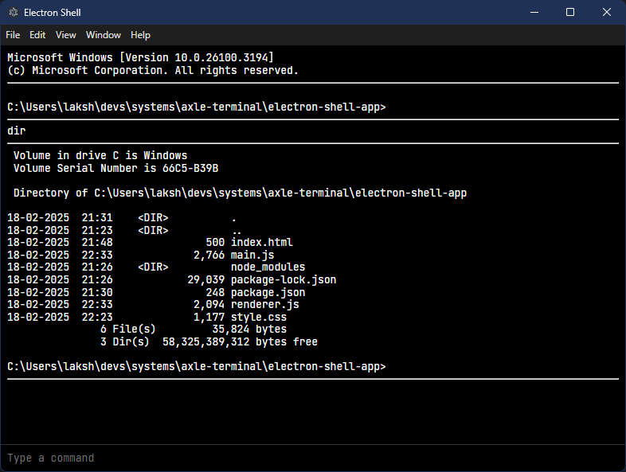

# axle-terminal

[Warp](https://www.warp.dev) style block based terminal that lets you choose your AI assistant.

### Tasks

- [ ] Fix tab-completions
- [ ] Better shell identification and handling
- [ ] Implement Block based outputs
- [ ] Adapters for unified LLM interface
- [ ] Smart command suggestions
- [ ] Structured outputs and better prompting

### Contributing

Feel free to fork the repository, make changes, and create a pull request if you have improvements or bug fixes.
